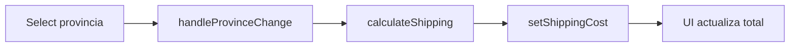
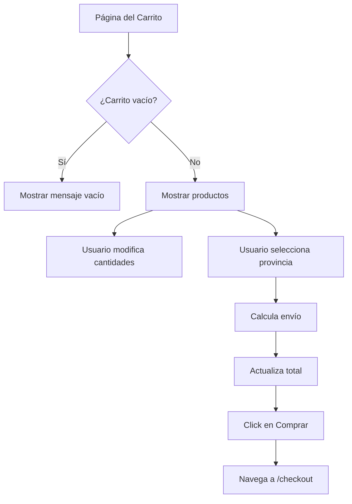

# cart/page.tsx

## Propósito

Página del carrito de compras que permite visualizar productos agregados, modificar cantidades, calcular costos de envío por provincia y proceder al checkout.

## Tabla de Contenidos

- [Importaciones](#importaciones)
- [Estado y Store](#estado-y-store)
- [Funciones de Cálculo](#funciones-de-cálculo)
- [UI Layout](#ui-layout)
- [Funcionalidades](#funcionalidades)

## Importaciones

```typescript
"use client";

import { FaRegTrashAlt } from "react-icons/fa";
import { useCartStore } from "@/store/cartStore";
import { useAuth } from "@/context/AuthContext";
import { useRouter } from "next/navigation";
import Link from "next/link";
```

- **"use client"**: Client Component para interactividad
- **FaRegTrashAlt**: Ícono de basurero de React Icons
- **useCartStore**: Hook de Zustand para gestión global del carrito
- **useState**: Hook para gestionar provincia seleccionada
- **Link**: Navegación de Next.js al checkout

## Estado y Store

### Estado Global (Zustand)

```typescript
const {
  cart,
  updateQuantity,
  removeFromCart,
  clearCart,
  shippingCost,
  setShippingCost,
} = useCartStore();
```

**Elementos del store**:

| Nombre | Tipo | Descripción |
|--------|------|-------------|
| `cart` | `Product[]` | Array de productos en el carrito |
| `updateQuantity` | `(id, qty) => void` | Actualiza cantidad de un producto |
| `removeFromCart` | `(id) => void` | Elimina producto del carrito |
| `clearCart` | `() => void` | Vacía todo el carrito |
| `shippingCost` | `number` | Costo de envío calculado |
| `setShippingCost` | `(cost) => void` | Establece costo de envío |

### Estado Local

```typescript
const [province, setProvince] = useState("");
```

- **province**: Provincia seleccionada para cálculo de envío
- **Tipo**: `string`
- **Default**: `""` (vacío)

## Funciones de Cálculo

### `calculateSubtotal()`

Calcula el subtotal de todos los productos en el carrito.

**Retorno**: `number` - Suma de `precio × cantidad` de todos los items

**Implementación**:
```typescript
const calculateSubtotal = () => {
  return cart.reduce((acc, item) => acc + item.price * item.quantity, 0);
};
```

**Ejemplo**:
```typescript
// Cart: [{ price: 3500, quantity: 2 }, { price: 4200, quantity: 1 }]
// Subtotal: (3500 × 2) + (4200 × 1) = 11200
```

---

### `calculateShipping(prov)`

Calcula el costo de envío según la provincia.

**Parámetros**:
- `prov: string` - Nombre de la provincia

**Retorno**: `number` - Costo de envío en pesos (0 si provincia no existe)

**Tabla de Costos**:

| Provincia | Costo |
|-----------|-------|
| Buenos Aires | $4,500 |
| CABA | $3,500 |
| Córdoba | $6,000 |
| Santa Fe | $6,500 |
| Mendoza | $7,000 |
| Tucumán | $7,500 |
| Salta | $8,000 |
| Neuquén | $9,000 |
| Río Negro | $9,200 |
| Chubut | $10,000 |
| Santa Cruz | $12,000 |
| Tierra del Fuego | $15,000 |

**Implementación**:
```typescript
const table: Record<string, number> = {
  "Buenos Aires": 4500,
  // ... resto de provincias
};
return table[prov] || 0;
```

**Lógica de negocio**:
- Envíos más baratos: CABA ($3,500) y Buenos Aires ($4,500)
- Envíos más caros: Patagonia (hasta $15,000)
- Default: $0 si no selecciona provincia

---

### `handleProvinceChange(e)`

Handler del selector de provincia.

**Parámetros**:
- `e: React.ChangeEvent<HTMLSelectElement>` - Evento del select

**Flujo**:
1. Extrae valor de la provincia
2. Actualiza estado local
3. Calcula costo de envío
4. Actualiza store global

```typescript
const prov = e.target.value;
setProvince(prov);
setShippingCost(calculateShipping(prov));
```

**Side effects**:
- Estado local actualizado
- Store global `shippingCost` actualizado
- UI re-renderiza con nuevo total

## UI Layout

### Estructura de Grid

```jsx
<div className="grid grid-cols-1 lg:grid-cols-3 gap-8">
  <div className="lg:col-span-2">
    {/* Lista de productos */}
  </div>
  <div>
    {/* Resumen de compra */}
  </div>
</div>
```

**Responsive**:
- **Móvil** (`< 1024px`): 1 columna (lista → resumen)
- **Desktop** (`≥ 1024px`): 2 columnas (2/3 lista, 1/3 resumen)

### Columna Izquierda: Lista de Productos

**Contenido**:
1. Título "Carrito"
2. Mensaje si está vacío
3. Cards de productos
4. Botón "Vaciar carrito"

#### Card de Producto

Cada ítem muestra:

```jsx
<div className="p-4 border rounded-lg bg-white shadow-sm">
  <div>
    <p className="font-semibold">{item.name}</p>
    <p className="text-gray-700">${item.price}</p>
  </div>
  
  <div className="flex items-center gap-3">
    {/* Controles de cantidad */}
    <button onClick={decrease}>-</button>
    <span>{item.quantity}</span>
    <button onClick={increase}>+</button>
    
    {/* Botón eliminar */}
    <button onClick={remove}>
      <svg>{/* Ícono basurero */}</svg>
    </button>
  </div>
</div>
```

**Funcionalidades por ítem**:
- **Disminuir**: Mínimo 1 (usa `Math.max(1, quantity - 1)`)
- **Aumentar**: Sin límite máximo
- **Eliminar**: Ícono SVG de basurero con hover scale

#### Botón Vaciar Carrito

```jsx
<button onClick={clearCart} className="bg-red-500">
  <FaRegTrashAlt size={18} />
  Vaciar carrito
</button>
```

- Fondo rojo (`bg-red-500`)
- Ícono de React Icons
- Hover: Oscurece a `bg-red-600`

### Columna Derecha: Resumen de Compra

**Visibilidad**: Solo si `cart.length > 0`

**Posición**: Sticky en desktop (`sticky top-24`)

**Contenido**:

1. **Subtotal de productos**
   ```jsx
   <p>Productos: ${subtotal}</p>
   ```

2. **Selector de Provincia**
   ```jsx
   <select value={province} onChange={handleProvinceChange}>
     <option value="">Seleccionar provincia</option>
     <option>Buenos Aires</option>
     {/* ... todas las provincias */}
   </select>
   ```

3. **Costo de Envío**
   ```jsx
   <p>Costo de envío: ${shippingCost}</p>
   ```

4. **Total Final**
   ```jsx
   <p className="text-2xl font-bold">
     Total: ${total}
   </p>
   ```
   - `total = subtotal + shippingCost`

5. **Botón Comprar**
   ```jsx
   <Link href="/checkout" className="bg-blue-600">
     Comprar
   </Link>
   ```

## Funcionalidades

### 1. Modificar Cantidad

**UX**: Botones +/- junto al número

**Lógica**:
```typescript
// Disminuir
updateQuantity(item.id, Math.max(1, item.quantity - 1))

// Aumentar
updateQuantity(item.id, item.quantity + 1)
```

**Restricción**: Mínimo 1 unidad (no permite 0)

### 2. Eliminar Producto

**Trigger**: Click en ícono de basurero

**Efecto**: Remueve ítem del carrito

```typescript
removeFromCart(item.id)
```

**Animación**: Hover scale del ícono (`hover:scale-110`)

### 3. Vaciar Carrito

**Trigger**: Botón "Vaciar carrito"

**Efecto**: Elimina todos los productos

```typescript
clearCart()
```

**Color**: Rojo para indicar acción destructiva

### 4. Calcular Envío

**Trigger**: Selección de provincia

**Flujo**:


**Estado inicial**: $0 hasta que se selecciona provincia

### 5. Proceder a Checkout

**Trigger**: Click en botón "Comprar"

**Lógica**:
1. Si el usuario no está logueado:
   - Redirige a `/login?redirect=/checkout`.
2. Si está logueado:
   - Navega a `/checkout`.

**Datos llevados**: El carrito persiste en Zustand (global).

## Estilos y Diseño

### Paleta de Colores

| Elemento | Color | Código |
|----------|-------|--------|
| Fondo cards | Blanco | `bg-white` |
| Título | Blanco | `text-white` |
| Texto precio | Negro | `text-black` |
| Botón eliminar | Rojo | `text-red-600` |
| Botón vaciar | Rojo | `bg-red-500` |
| Botón comprar | Azul | `bg-blue-600` |

### Espaciado

- Container: `max-w-6xl mx-auto p-6`
- Gap entre columnas: `gap-8`
- Espacio entre cards: `space-y-4`

### Responsive

- Padding top: `mt-20` (compensa Navbar fijo)
- Grid: `grid-cols-1 lg:grid-cols-3`
- Resumen: `sticky top-24` solo en desktop

## Cálculos Finales

```typescript
const subtotal = calculateSubtotal(); // Suma de productos
const total = subtotal + shippingCost; // Total final
```

**Ejemplo de cálculo**:
```
Productos:
  - Taza 1: $3,500 × 2 = $7,000
  - Taza 2: $4,200 × 1 = $4,200
  
Subtotal: $11,200
Envío (CABA): $3,500
Total: $14,700
```

## Consideraciones de Mejora

### Funcionalidad

- [ ] Agregar confirmación antes de vaciar carrito
- [ ] Implementar cupones de descuento
- [ ] Mostrar tiempo estimado de envío por provincia
- [ ] Validar stock antes de aumentar cantidad
- [ ] Persistir carrito en localStorage

### UX

- [ ] Animación al eliminar producto
- [ ] Loader al calcular envío
- [ ] Deshabilitar botón "-" cuando cantidad = 1
- [ ] Mostrar mensaje si carrito se vació
- [ ] Auto-scroll al resumen en móvil

### Validaciones

- [ ] Verificar que hay productos antes de ir a checkout
- [ ] Requerir provincia antes de checkout
- [ ] Validar disponibilidad de productos

## Archivos Relacionados

- [cartStore.ts](file:///c:/Users/Malena%20Cort%C3%A9s/OneDrive/Desktop/tazas-personalizables/frontend/src/store/cartStore.ts) - Store de Zustand
- [products/page.tsx](file:///c:/Users/Malena%20Cort%C3%A9s/OneDrive/Desktop/tazas-personalizables/frontend/src/app/products/page.tsx) - Catálogo de productos
- [checkout/page.jsx](file:///c:/Users/Malena%20Cort%C3%A9s/OneDrive/Desktop/tazas-personalizables/frontend/src/app/checkout/page.jsx) - Página de checkout

## Flujo de Usuario



## Ejemplo de Uso

Ruta de acceso:
```
http://localhost:3000/cart
```

Escenario típico:
1. Usuario agregó productos desde `/products`
2. Ve resumen de items en el carrito
3. Ajusta cantidades si es necesario
4. Selecciona su provincia
5. Ve el total calculado con envío
6. Hace click en "Comprar" → va a checkout
