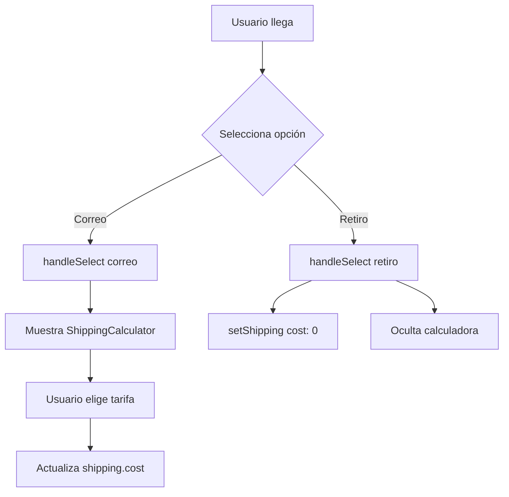

# ShippingOptions.jsx

## Propósito

Componente para seleccionar el método de envío en el checkout. Ofrece opciones entre Correo Argentino (con calculadora de costo) y retiro en domicilio gratuito.

## Importaciones

```jsx
"use client";
import { useState } from "react";
import { useCheckout } from "@/context/CheckoutContext";
import ShippingCalculator from "@/components/ShippingCalculator";
```

## Hooks

### Contexto de Checkout

```jsx
const { shipping, setShipping } = useCheckout();
```

- **shipping**: Objeto `{ method: string, cost: number }`
- **setShipping**: Función para actualizar shipping en el contexto

### Estado Local

```jsx
const [showCalculator, setShowCalculator] = useState(false);
```

- Controla la visibilidad del componente `ShippingCalculator`

## Funciones

### `handleSelect(method)`

Actualiza el método de envío seleccionado en el contexto.

```jsx
const handleSelect = (method) => {
  setShipping({
    ...shipping,
    method,
  });
};
```

## Opciones de Envío

### 1. Correo Argentino

**Radio button**:
- `name="shipping"`
- Checked cuando: `shipping.method === "correo"`

**Comportamiento al seleccionar**:
```jsx
onChange={() => {
  handleSelect("correo");
  setShowCalculator(true);  // Muestra calculadora
}}
```

**Texto**: "Correo Argentino (costo según ciudad)"

**Calculadora**: Se muestra `ShippingCalculator` condicionalmente

### 2. Retiro en Domicilio

**Radio button**:
- `name="shipping"`
- Checked cuando: `shipping.method === "retiro"`

**Comportamiento al seleccionar**:
```jsx
onChange={() => {
  handleSelect("retiro");
  setShowCalculator(false);  // Oculta calculadora
  setShipping({ method: "retiro", cost: 0 });  // Costo 0
}}
```

**Texto**: "Retiro por domicilio (Gratis)"

## Componente ShippingCalculator

Renderizado condicionalmente:

```jsx
{showCalculator && (
  <div className="mt-4">
    <ShippingCalculator />
  </div>
)}
```

**Condición**: Solo si `showCalculator === true` (Correo Argentino seleccionado)

**Documentación**: [ShippingCalculator.tsx](file:///c:/Users/Malena%20Cort%C3%A9s/OneDrive/Desktop/tazas-personalizables/docs/frontend/components/ShippingCalculator.tsx.md)

## UI Estructura

```jsx
<div className="p-6 border rounded-lg shadow-sm flex flex-col gap-4">
  <h2 className="text-2xl font-semibold">Método de Envío</h2>
  
  <div className="flex flex-col gap-3">
    {/* Radio buttons */}
  </div>
  
  {showCalculator && <ShippingCalculator />}
</div>
```

## Flujo de Interacción



## Integración con Contexto

**Datos guardados en contexto**:
```typescript
shipping: {
  method: "correo" | "retiro" | "",
  cost: number
}
```

**Persistencia**: El CheckoutContext persiste estos datos en localStorage

## arch相关Relacionados

- [CheckoutContext.jsx](file:///c:/Users/Malena%20Cort%C3%A9s/OneDrive/Desktop/tazas-personalizables/frontend/src/context/CheckoutContext.jsx)
- [ShippingCalculator.tsx](file:///c:/Users/Malena%20Cort%C3%A9s/OneDrive/Desktop/tazas-personalizables/frontend/src/components/ShippingCalculator.tsx)
- [OrderSummary.jsx](file:///c:/Users/Malena%20Cort%C3%A9s/OneDrive/Desktop/tazas-personalizables/frontend/src/app/checkout/components/OrderSummary.jsx.md)
