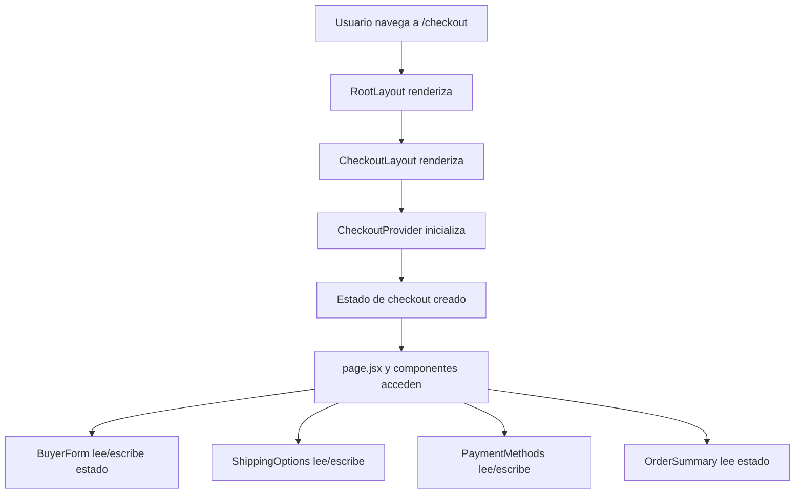

# checkout/layout.jsx

## Propósito

Layout específico para la ruta `/checkout` que envuelve las páginas de checkout con el `CheckoutProvider`, proporcionando contexto compartido para todo el flujo de compra.

## Importaciones

```jsx
"use client";

import { CheckoutProvider } from "@/context/CheckoutContext";
```

- **"use client"**: Requerido porque usa React Context (client-side)
- **CheckoutProvider**: Proveedor del contexto de checkout

## Componente

### `Layout({ children })`

**Tipo**: Client Component

**Parámetros**:
- `children: React.ReactNode` - Contenido de las páginas hijas (`page.jsx`)

**Retorno**: JSX con el provider envolviendo a los children

## Estructura

```jsx
export default function Layout({ children }) {
  return (
    <CheckoutProvider>
      {children}
    </CheckoutProvider>
  );
}
```

**Simplicidad**: Componente minimalista con única responsabilidad

## Funcionamiento

### Patrón de Layout Anidado

Next.js permite layouts anidados:

```
/app/layout.tsx                    ← Layout raíz (global)
  └── /app/checkout/layout.jsx     ← Layout de checkout
        └── /app/checkout/page.jsx ← Página de checkout
```

**Jerarquía de renderizado**:
```jsx
<RootLayout>
  <Navbar />
  <CheckoutLayout>
    <CheckoutProvider>
      <CheckoutPage />
    </CheckoutProvider>
  </CheckoutLayout>
  <Footer />
</RootLayout>
```

### Scope del Provider

El `CheckoutProvider` SOLO afecta a:
- `/app/checkout/page.jsx`
- Cualquier sub-ruta futura como `/checkout/success`, `/checkout/confirm`, etc.

**NO afecta a**:
- `/app/page.tsx` (home)
- `/app/products/page.tsx`
- `/app/cart/page.tsx`

Esto optimiza el rendimiento y evita estado innecesario en otras rutas.

## Contexto de Checkout

### Estado Compartido

El `CheckoutProvider` proporciona estado global para el flujo de checkout:

```typescript
interface CheckoutState {
  subtotal: number;
  shippingCost: number;
  selectedShipping: string;
  selectedPayment: string;
  buyerInfo: BuyerData;
  // ... otros campos
}
```

### Componentes que Consumen el Contexto

Todos dentro de `/checkout`:
- `BuyerForm.jsx`
- `ShippingOptions.jsx`
- `PaymentMethods.jsx`
- `OrderSummary.jsx`

**Acceso**:
```jsx
import { useCheckout } from "@/context/CheckoutContext";

function BuyerForm() {
  const { buyerInfo, setBuyerInfo } = useCheckout();
  // ...
}
```

## Ventajas de este Patrón

### 1. Scope Limitado

✅ **Beneficio**: El contexto solo existe donde se necesita

```
❌ Sin layout específico:
- CheckoutProvider en layout.tsx global
- Estado de checkout en TODAS las páginas
- Overhead innecesario

✅ Con layout específico:
- CheckoutProvider solo en /checkout
- Estado aislado
- Mejor performance
```

### 2. Separación de Concerns

- **RootLayout**: Estructura global (Navbar, Footer)
- **CheckoutLayout**: Lógica de negocio del checkout
- **CheckoutPage**: UI y componentes

### 3. Facilita Rutas Adicionales

Puedes agregar más páginas que compartan el contexto:

```
/app/checkout/
  ├── layout.jsx          ← Este archivo
  ├── page.jsx            ← Formulario de checkout
  ├── success/
  │   └── page.jsx        ← También usa CheckoutProvider
  └── confirm/
      └── page.jsx        ← También usa CheckoutProvider
```

Todas heredan el provider automáticamente.

## Flujo de Datos



## Comparación con Otros Enfoques

### Opción 1: Provider Global (NO recomendado)

```jsx
// app/layout.tsx
<CheckoutProvider>
  <Navbar />
  {children} {/* TODAS las páginas */}
  <Footer />
</CheckoutProvider>
```

❌ **Problemas**:
- Estado de checkout existe en home, products, etc.
- Desperdicio de memoria
- Puede causar bugs de estado persistente

### Opción 2: Provider en Página (limitado)

```jsx
// app/checkout/page.jsx
export default function CheckoutPage() {
  return (
    <CheckoutProvider>
      <BuyerForm />
      {/* ... */}
    </CheckoutProvider>
  );
}
```

❌ **Problemas**:
- No funciona para sub-rutas (`/checkout/success`)
- Hay que repetir provider en cada página
- Estado se resetea entre navegaciones

### Opción 3: Layout Anidado (RECOMENDADO) ✅

```jsx
// app/checkout/layout.jsx (este archivo)
<CheckoutProvider>
  {children}
</CheckoutProvider>
```

✅ **Ventajas**:
- Provider solo donde se necesita
- Compartido entre `/checkout/*` routes
- Estado persiste entre sub-rutas
- Patrón estándar de Next.js

## Consideraciones

### Client Component Requerido

```jsx
"use client";
```

**Por qué**: React Context API solo funciona en el cliente

**Implicación**: Todo bajo este layout es client-side rendered

### Sin Estilos ni Estructura

Este layout NO agrega:
- ❌ Wrappers visuales
- ❌ Clases CSS
- ❌ Divs container

Solo provider lógico. El `RootLayout` ya maneja la estructura HTML.

### Alternativa: Layout con UI

Si quisieras un layout visual específico para checkout:

```jsx
export default function Layout({ children }) {
  return (
    <CheckoutProvider>
      <div className="checkout-container max-w-4xl mx-auto">
        <CheckoutProgressBar />
        {children}
      </div>
    </CheckoutProvider>
  );
}
```

Pero actualmente, solo provee contexto (más simple y flexible).

## Archivos Relacionados

- [CheckoutContext.jsx](file:///c:/Users/Malena%20Cort%C3%A9s/OneDrive/Desktop/tazas-personalizables/frontend/src/context/CheckoutContext.jsx) - Definición del contexto y provider
- [page.jsx](file:///c:/Users/Malena%20Cort%C3%A9s/OneDrive/Desktop/tazas-personalizables/frontend/src/app/checkout/page.jsx) - Página principal de checkout
- [layout.tsx](file:///c:/Users/Malena%20Cort%C3%A9s/OneDrive/Desktop/tazas-personalizables/frontend/src/app/layout.tsx) - Layout raíz global

## Ejemplo de Uso

Este archivo es usado automáticamente por Next.js. No se importa directamente.

Cuando un usuario navega a:
```
http://localhost:3000/checkout
```

Next.js automáticamente:
1. Renderiza `RootLayout`
2. Dentro, renderiza `CheckoutLayout` (este archivo)
3. Dentro, renderiza `page.jsx`

El usuario no ve diferencia, pero los componentes tienen acceso al contexto.

## Patrón de Implementación

Para crear un flujo similar en otra sección:

```jsx
// app/admin/layout.jsx
"use client";
import { AdminProvider } from "@/context/AdminContext";

export default function AdminLayout({ children }) {
  return (
    <AdminProvider>
      {children}
    </AdminProvider>
  );
}
```

Esto daría contexto de admin solo a `/admin/*` routes.
