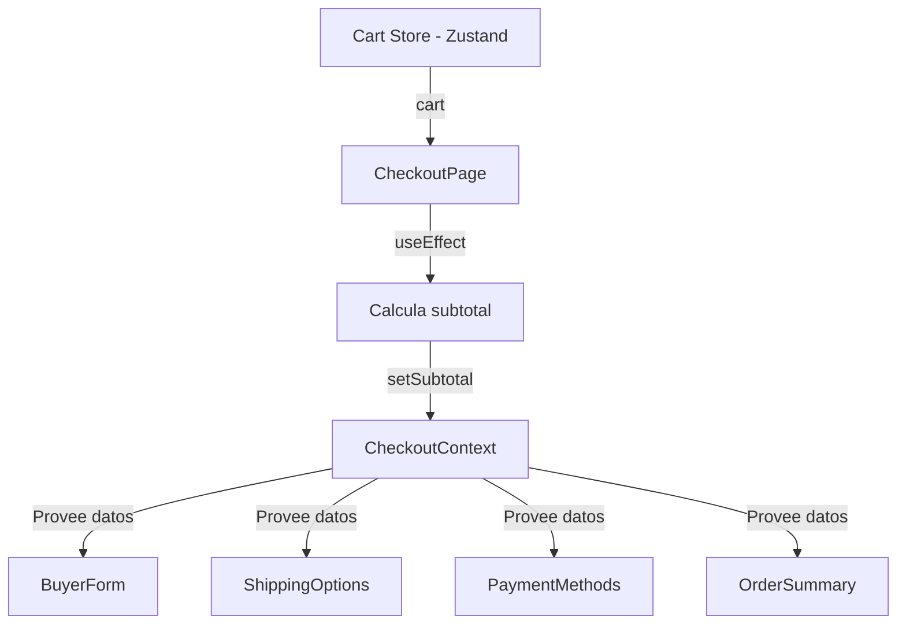
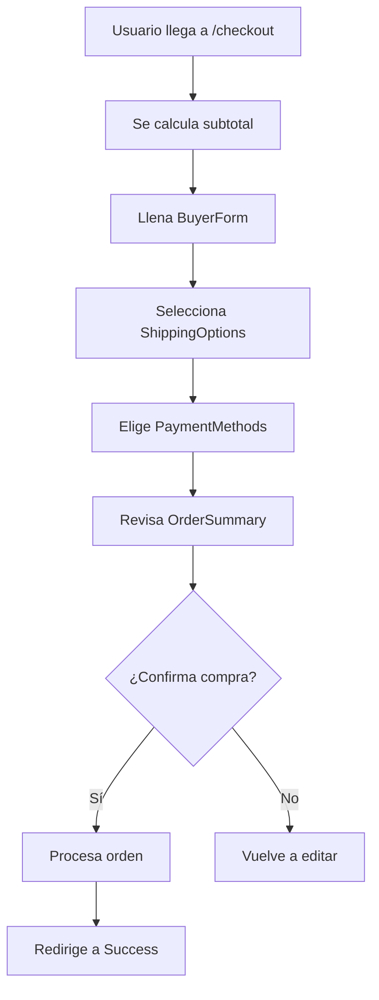

# checkout/page.jsx

## Propósito

Página principal del flujo de checkout. Orquesta el proceso de compra completo mediante componentes especializados para recolectar datos del comprador, opciones de envío, método de pago y resumen de la orden.

## Importaciones

```jsx
"use client";

import { useEffect } from "react";
import { useCartStore } from "@/store/cartStore";
import { useCheckout } from "@/context/CheckoutContext";
import { useAuth } from "@/context/AuthContext";
import { useRouter } from "next/navigation";

import BuyerForm from './components/BuyerForm'
import ShippingOptions from './components/ShippingOptions'
import PaymentMethods from './components/PaymentMethods'
import OrderSummary from './components/OrderSummary'
```

- **"use client"**: Client Component (requiere contexto y efectos)
- **useEffect**: Sincroniza subtotal con el contexto
- **useCartStore**: Acceso al carrito global (Zustand)
- **useCheckout**: Hook del contexto de checkout
- **Componentes**: Formularios y resumen del checkout

## Componente Principal

### `CheckoutPage()`

**Tipo**: Client Component

**Responsabilidad**: 
- Coordinar el flujo de checkout
- Sincronizar datos del carrito con el contexto
- Renderizar componentes en orden lógico

## Hooks Utilizados

### Store de Carrito

```jsx
const { cart } = useCartStore();
```

- **cart**: Array de productos para procesar en la compra

### Contexto de Checkout

```jsx
const { setSubtotal } = useCheckout();
```

- **setSubtotal**: Función para actualizar subtotal en el contexto compartido

## Efectos

### Sincronización de Subtotal

```jsx
useEffect(() => {
  if (!cart) return;

  const newSubtotal = cart.reduce(
    (acc, item) => acc + item.price * item.quantity,
    0
  );

  setSubtotal(newSubtotal);
**Trigger**: Ejecuta cuando `cart` o `setSubtotal` cambian

### Protección de Autenticación

```jsx
useEffect(() => {
  if (!loading && !user) {
    router.push("/login?redirect=/checkout");
  }
}, [user, loading, router]);
```

**Propósito**: Asegurar que solo usuarios autenticados accedan al checkout. Si no hay sesión, redirige al login preservando el destino.
```

**Propósito**: Mantener el subtotal actualizado en el contexto de checkout

**Trigger**: Ejecuta cuando `cart` o `setSubtotal` cambian

**Flujo**:
1. Verifica que existe el carrito
2. Calcula subtotal sumando `precio × cantidad` de cada ítem
3. Actualiza contexto con `setSubtotal()`

**Ejemplo de cálculo**:
```javascript
// Cart: [{ price: 3500, qty: 2 }, { price: 4200, qty: 1 }]
// newSubtotal = (3500 × 2) + (4200 × 1) = 11200
```

**Guard clause**: `if (!cart) return` evita errores si cart es null/undefined

## Estructura de UI

### Layout

```jsx
<div className="max-w-4xl mx-auto py-10 px-4 flex flex-col gap-8">
  <h1 className="text-3xl font-bold">Checkout</h1>
  
  <BuyerForm />
  <ShippingOptions />
  <PaymentMethods />
  <OrderSummary />
</div>
```

**Container**:
- Max width: `max-w-4xl` (896px)
- Centrado: `mx-auto`
- Padding: `py-10 px-4`
- Layout: Columna vertical con `gap-8` entre secciones

### Componentes Renderizados (en orden)

1. **BuyerForm**: Datos personales del comprador
2. **ShippingOptions**: Selección de método y dirección de envío
3. **PaymentMethods**: Selección de método de pago
4. **OrderSummary**: Resumen final y botón de confirmación

## Flujo de Datos



**Patrón**: Arquitectura unidireccional

1. Carrito (Zustand) → CheckoutPage
2. CheckoutPage → Calcula y actualiza contexto
3. Contexto → Todos los componentes hijos

## Componentes Hijos

### BuyerForm

**Responsabilidad**: Recolectar datos del comprador

**Campos esperados**:
- Nombre completo
- Email
- Teléfono
- DNI/documento

**Documentación**: [BuyerForm.jsx.md](file:///c:/Users/Malena%20Cort%C3%A9s/OneDrive/Desktop/tazas-personalizables/docs/frontend/app/checkout/components/BuyerForm.jsx.md)

---

### ShippingOptions

**Responsabilidad**: Selección de envío

**Opciones esperadas**:
- Envío a domicilio
- Retiro en sucursal
- Campo de dirección

**Documentación**: [ShippingOptions.jsx.md](file:///c:/Users/Malena%20Cort%C3%A9s/OneDrive/Desktop/tazas-personalizables/docs/frontend/app/checkout/components/ShippingOptions.jsx.md)

---

### PaymentMethods

**Responsabilidad**: Selección de método de pago

**Opciones esperadas**:
- Tarjeta de crédito/débito
- Transferencia bancaria
- Mercado Pago
- Efectivo

**Documentación**: [PaymentMethods.jsx.md](file:///c:/Users/Malena%20Cort%C3%A9s/OneDrive/Desktop/tazas-personalizables/docs/frontend/app/checkout/components/PaymentMethods.jsx.md)

---

### OrderSummary

**Responsabilidad**: Resumen y confirmación

**Muestra**:
- Productos del carrito
- Subtotal
- Costo de envío
- Total final
- Botón de confirmación

**Documentación**: [OrderSummary.jsx.md](file:///c:/Users/Malena%20Cort%C3%A9s/OneDrive/Desktop/tazas-personalizables/docs/frontend/app/checkout/components/OrderSummary.jsx.md)

## Contexto de Checkout

### Provider

Este componente está envuelto en `CheckoutProvider` a través del layout:

```jsx
// app/checkout/layout.jsx
<CheckoutProvider>
  <CheckoutPage />
</CheckoutProvider>
```

### Estado Compartido

El contexto gestiona:
- `subtotal`: Calculado desde el carrito
- `shippingMethod`: Opción de envío seleccionada
- `paymentMethod`: Método de pago seleccionado
- `buyerData`: Información del comprador

**Documentación**: [CheckoutContext.jsx.md](file:///c:/Users/Malena%20Cort%C3%A9s/OneDrive/Desktop/tazas-personalizables/docs/frontend/context/CheckoutContext.jsx.md)

## Validaciones

### Validaciones Actuales

⚠️ **Nota**: No hay validaciones explícitas en este archivo

### Validaciones Recomendadas

```jsx
// Verificar que hay productos en el carrito
useEffect(() => {
  if (cart.length === 0) {
    router.push('/cart');
  }
}, [cart]);

// Validar antes de permitir checkout
const canCheckout = () => {
  return cart.length > 0 && 
         buyerData.isComplete &&
         shippingMethod !== null &&
         paymentMethod !== null;
};
```

## Flujo de Usuario



## Estilos

### Container Principal

```css
max-w-4xl     /* 896px máximo */
mx-auto       /* Centrado horizontal */
py-10         /* Padding vertical 2.5rem */
px-4          /* Padding horizontal 1rem */
flex flex-col /* Columna vertical */
gap-8         /* Espacio entre hijos 2rem */
```

### Título

```css
text-3xl      /* Font size 1.875rem (30px) */
font-bold     /* Font weight 700 */
```

## Consideraciones de Mejora

### Funcionalidad Pendiente

- [ ] Validar que el carrito no esté vacío
- [ ] Redirigir a `/cart` si no hay productos
- [ ] Guardar progreso del checkout en localStorage
- [ ] Implementar navegación paso a paso
- [ ] Agregar indicador de progreso (stepper)

### UX

- [ ] Mostrar errores de validación
- [ ] Deshabilitar secciones hasta completar anteriores
- [ ] Agregar botón "Volver al carrito"
- [ ] Implementar auto-guardado de formularios
- [ ] Loading state durante procesamiento

### Seguridad

- [ ] Validar datos antes de enviar al backend
- [ ] Sanitizar inputs de usuario
- [ ] Implementar CSRF protection
- [ ] Encriptar datos sensibles (tarjeta)

## Integración con Backend

### Endpoint Esperado

```javascript
// Al confirmar orden en OrderSummary
POST /api/orders
{
  buyer: { name, email, phone, document },
  items: cart,
  shipping: { method, address },
  payment: { method, details },
  totals: { subtotal, shipping, total }
}
```

**Respuesta esperada**:
```json
{
  "orderId": "ORD-12345",
  "status": "pending_payment",
  "paymentUrl": "https://mercadopago.com/pay/..."
}
```

## Archivos Relacionados

- [layout.jsx](file:///c:/Users/Malena%20Cort%C3%A9s/OneDrive/Desktop/tazas-personalizables/frontend/src/app/checkout/layout.jsx) - Provee CheckoutProvider
- [CheckoutContext.jsx](file:///c:/Users/Malena%20Cort%C3%A9s/OneDrive/Desktop/tazas-personalizables/frontend/src/context/CheckoutContext.jsx) - Contexto compartido
- [cartStore.ts](file:///c:/Users/Malena%20Cort%C3%A9s/OneDrive/Desktop/tazas-personalizables/frontend/src/store/cartStore.ts) - Store del carrito
- [cart/page.tsx](file:///c:/Users/Malena%20Cort%C3%A9s/OneDrive/Desktop/tazas-personalizables/frontend/src/app/cart/page.tsx) - Página previa del carrito

## Ejemplo de Uso

Ruta de acceso:
```
http://localhost:3000/checkout
```

Prerequisito: Debe haber productos en el carrito (Zustand store)

Flujo típico:
1. Usuario viene desde `/cart` con productos
2. Se calcula automáticamente el subtotal
3. Completa formularios en orden
4. Confirma compra en OrderSummary
5. Redirige a página de éxito o pago
