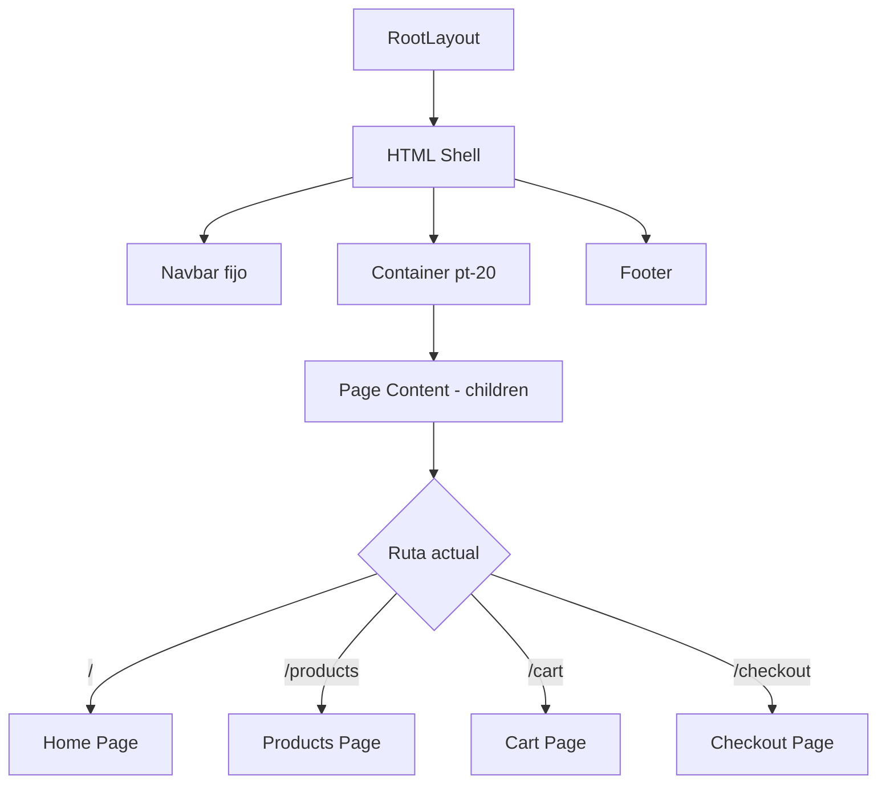

# layout.tsx

## Propósito

Layout raíz de la aplicación Next.js. Define la estructura HTML base, metadata SEO y componentes globales (Navbar y Footer) que se renderizan en todas las páginas.

## Importaciones

```typescript
import type { Metadata } from "next";
import "./globals.css";
import Navbar from "@/components/Navbar";
import Footer from "@/components/Footer";
```

- **Metadata**: Tipo de TypeScript para metadata SEO de Next.js
- **globals.css**: Estilos globales y configuración de Tailwind CSS
- **Navbar**: Componente de barra de navegación superior
- **Footer**: Componente de pie de página

## Metadata SEO

```typescript
export const metadata: Metadata = {
  title: "Tazas Personalizables",
  description: "Crea tu propia taza personalizada",
};
```

### Campos Configurados

| Campo | Valor | Uso |
|-------|-------|-----|
| `title` | "Tazas Personalizables" | Título de la pestaña del navegador y SEO |
| `description` | "Crea tu propia taza personalizada" | Meta description para motores de búsqueda |

### Mejoras Recomendadas

Para mejorar SEO, se podrían agregar:

```typescript
export const metadata: Metadata = {
  title: "Tazas Personalizables",
  description: "Crea tu propia taza personalizada",
  // Sugerencias:
  keywords: ["tazas personalizadas", "tazas con foto", "regalos personalizados"],
  authors: [{ name: "Tu Nombre" }],
  openGraph: {
    title: "Tazas Personalizables",
    description: "Crea tu propia taza personalizada",
    images: ["/og-image.jpg"],
  },
  twitter: {
    card: "summary_large_image",
  },
};
```

## Componente RootLayout

### Firma

```typescript
export default function RootLayout({ 
  children 
}: { 
  children: React.ReactNode 
})
```

### Parámetros

- **children**: Contenido de la página actual (inyectado por Next.js router)

### Estructura HTML

```jsx
<html lang="es">
  <body>
    <Navbar />
    <div className="pt-20">
      {children}
    </div>
    <Footer />
  </body>
</html>
```

### Elementos Clave

1. **`<html lang="es">`**: Idioma español para accesibilidad y SEO

2. **`<Navbar />`**: Barra de navegación fija en la parte superior
   - Renderizada globalmente en todas las páginas
   - Permite navegación consistente

3. **`<div className="pt-20">`**: Contenedor de contenido
   - `pt-20`: Padding-top de 5rem (80px)
   - Compensa la altura del Navbar fijo
   - Evita que el contenido quede oculto debajo de la navbar

4. **`{children}`**: Página activa
   - Renderiza el contenido de la ruta actual
   - Cambia dinámicamente según la navegación

5. **`<Footer />`**: Pie de página
   - Renderizado globalmente en todas las páginas
   - Información de contacto, enlaces, etc.

## Flujo de Renderizado



## Características de Next.js

### Server Component

Este layout es un **Server Component** por defecto en Next.js 13+ App Router:
- Renderizado en el servidor
- No incluye interactividad del cliente (sin `"use client"`)
- Metadata estática exportada para SEO

### Persistent Layout

El layout es **persistente** entre navegaciones:
- No se re-renderiza al cambiar de página
- Solo `{children}` se actualiza
- Mejora el rendimiento y mantiene estado de Navbar/Footer

## Estilos Aplicados

### Clases de Tailwind

| Elemento | Clase | Efecto |
|----------|-------|--------|
| Container principal | `pt-20` | Padding-top de 80px |

### Archivo globals.css

El layout importa `globals.css` que contiene:
- Configuración de Tailwind (`@tailwind base/components/utilities`)
- Variables CSS custom
- Reset de estilos
- Clases utilitarias personalizadas

## Compatibilidad con Providers

⚠️ **Nota**: Este layout NO incluye providers de React Context. 

Para rutas que necesitan contexto (como `/checkout`), se utiliza un layout anidado:

```
/app/layout.tsx         ← Este archivo (global)
/app/checkout/layout.jsx ← Layout específico con CheckoutProvider
```

## Accesibilidad

- ✅ Atributo `lang="es"` en HTML
- ✅ Estructura semántica con Navbar y Footer
- ⚠️ Falta `<head>` explícito (Next.js lo maneja automáticamente)
- ⚠️ Considerar agregar skip link para saltar navegación

### Mejora Sugerida

```jsx
<body>
  <a href="#main-content" className="sr-only focus:not-sr-only">
    Skip to main content
  </a>
  <Navbar />
  <div id="main-content" className="pt-20">
    {children}
  </div>
  <Footer />
</body>
```

## Archivos Relacionados

- [globals.css](file:///c:/Users/Malena%20Cort%C3%A9s/OneDrive/Desktop/tazas-personalizables/frontend/src/app/globals.css) - Estilos globales
- [Navbar.tsx](file:///c:/Users/Malena%20Cort%C3%A9s/OneDrive/Desktop/tazas-personalizables/frontend/src/components/Navbar.tsx) - Componente de navegación
- [Footer.tsx](file:///c:/Users/Malena%20Cort%C3%A9s/OneDrive/Desktop/tazas-personalizables/frontend/src/components/Footer.tsx) - Componente de pie de página
- [page.tsx](file:///c:/Users/Malena%20Cort%C3%A9s/OneDrive/Desktop/tazas-personalizables/frontend/src/app/page.tsx) - Página principal (children)
- [checkout/layout.jsx](file:///c:/Users/Malena%20Cort%C3%A9s/OneDrive/Desktop/tazas-personalizables/frontend/src/app/checkout/layout.jsx) - Layout anidado con provider

## Patrones de Diseño

### Layout Pattern

Este archivo implementa el **Layout Pattern** de Next.js:
- Define estructura común para todas las páginas
- Evita duplicación de código
- Mantiene consistencia visual

### Component Composition

Composición de componentes:
```
RootLayout
  ├── Navbar (global)
  ├── PageContent (variable)
  └── Footer (global)
```

## Referencias

- [Next.js Layouts Documentation](https://nextjs.org/docs/app/building-your-application/routing/pages-and-layouts)
- [Next.js Metadata API](https://nextjs.org/docs/app/api-reference/functions/generate-metadata)
