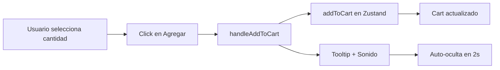

# products/page.tsx

## Propósito

Página de catálogo de productos con diseño inspirado en Mercado Libre. Permite ver productos disponibles, agregar al carrito con cantidades personalizadas y muestra filtros laterales simulados.

## Tabla de Contenidos

- [Importaciones](#importaciones)
- [Componente Principal](#componente-principal)
- [Estado Local](#estado-local)
- [Datos de Productos](#datos-de-productos)
- [Funciones](#funciones)
- [UI/UX](#uiux)
- [Interactividad](#interactividad)

## Importaciones

```typescript
"use client";

import { useState } from "react";
import Image from "next/image";
import { useCartStore, Product } from "@/store/cartStore";
```

- **"use client"**: Marca este componente como Client Component (requiere interactividad)
- **useState**: Hook de React para gestionar estado local
- **Image**: Componente optimizado de Next.js
- **useCartStore**: Hook de Zustand para acceder al store del carrito
- **Product**: Tipo TypeScript para productos

## Componente Principal

### `ProductsPage()`

**Tipo**: Client Component (interactive)

**Responsabilidades**:
1. Mostrar listado de productos
2. Gestionar cantidades antes de agregar al carrito
3. Agregar productos al store global
4. Mostrar feedback visual (tooltip)
5. Reproducir sonido de confirmación

## Estado Local

```typescript
const [tooltipVisible, setTooltipVisible] = useState<number | null>(null);
const [quantities, setQuantities] = useState<Record<number, number>>({});
```

### `tooltipVisible`

- **Tipo**: `number | null`
- **Propósito**: ID del producto que muestra tooltip "¡Agregado!"
- **Duración**: 2 segundos (auto-oculta con timeout)

### `quantities`

- **Tipo**: `Record<number, number>` (objeto clave-valor)
- **Propósito**: Almacenar cantidad seleccionada para cada producto
- **Ejemplo**: `{ 1: 3, 2: 1 }` significa 3 unidades del producto 1, 1 del producto 2
- **Default**: 1 si no está definido

## Datos de Productos

### Array de Productos

```typescript
const products: Product[] = [...]
```

**Cantidad**: 3 productos hardcoded

**Estructura de cada producto**:

```typescript
interface Product {
  id: number;
  name: string;
  description: string;
  price: number;
  image: string;
}
```

### Productos Disponibles

| ID | Nombre | Precio | Descripción |
|----|--------|--------|-------------|
| 1 | Taza Minimalista Cerámica Premium | $3,500 | Diseño simple y elegante |
| 2 | Taza Personalizada Con Tu Foto | $4,200 | Impresión en alta calidad |
| 3 | Taza Ilustrada Diseño Artístico | $3,900 | Ilustraciones de artistas locales |

⚠️ **Nota**: Datos estáticos. En  producción deberían provenir de una API:

```typescript
// Implementación sugerida:
const { data: products } = await fetch('/api/products');
```

## Funciones

### `handleQuantityChange(productId, delta)`

Modifica la cantidad seleccionada de un producto.

**Parámetros**:
- `productId: number` - ID del producto
- `delta: number` - Cambio (+1 o -1)

**Lógica**:
```typescript
setQuantities((prev) => ({
  ...prev,
  [productId]: Math.max((prev[productId] || 1) + delta, 1),
}));
```

- Usa `Math.max(..., 1)` para garantizar mínimo de 1 unidad
- Mantiene cantidades de otros productos intactas (spread operator)

**Uso**:
```typescript
handleQuantityChange(1, +1); // Incrementa producto 1
handleQuantityChange(2, -1); // Decrementa producto 2
```

---

### `handleAddToCart(product)`

Agrega el producto al carrito con la cantidad seleccionada.

**Parámetros**:
- `product: Product` - Objeto del producto a agregar

**Flujo**:
1. Obtiene cantidad del estado local (default 1)
2. Llama a `addToCart` del store de Zustand
3. Muestra tooltip de confirmación
4. Reproduce sonido de click
5. Auto-oculta tooltip después de 2s

**Código**:
```typescript
const quantity = quantities[product.id] || 1;
addToCart({ ...product, quantity });
setTooltipVisible(product.id);
clickSound?.play();
setTimeout(() => setTooltipVisible(null), 2000);
```

**Side Effects**:
- Estado global del carrito actualizado
- Sonido reproducido
- Tooltip temporal mostrado

## UI/UX

### Layout

**Estructura**:
```
Main Container (max-w-6xl)
├── Sidebar (filtros) - Desktop only
└── Products List - Responsive
    └── Product Cards (3 items)
```

### Sidebar de Filtros

**Ubicación**: Izquierda, `w-64`, oculto en móvil (`hidden md:block`)

**Filtros Simulados**:
1. **Categorías**: Cerámica (120), Plástico (45), Mágicas (12)
2. **Precio**: Rangos de precio con cantidad de resultados
3. **Envío**: Checkbox "Envío gratis"

⚠️ **Estado**: Filtros NO funcionales, solo visuales

**Implementación sugerida**:
```typescript
const [filters, setFilters] = useState({
  category: null,
  priceRange: null,
  freeShipping: false
});

const filteredProducts = products.filter(p => {
  if (filters.category && p.category !== filters.category) return false;
  if (filters.freeShipping && !p.freeShipping) return false;
  return true;
});
```

### Product Cards

**Diseño**: Lista vertical con hover effect

**Estructura de cada card**:

1. **Imagen**:
   - Tamaño: `w-48 h-48` en desktop, `w-full` en móvil
   - `object-contain` para mantener proporción
   - Esquinas redondeadas

2. **Información del producto**:
   - **Nombre**: `text-xl font-light`, clickeable (no implementado)
   - **Precio**: `text-3xl` con formato local (`toLocaleString("es-AR")`)
   - **Badge**: "5% OFF" en verde `#00A650`
   - **Envío**: "Envío gratis mañana" en verde
   - **Descripción**: Solo visible en desktop (`hidden md:block`)

3. **Controles de compra**:
   - Selector de cantidad (botones +/-)
   - Botón "Agregar al carrito"
   - Tooltip de confirmación

### Controles de Cantidad

**Diseño**: Input numérico custom con botones

```jsx
<div className="flex items-center border">
  <button onClick={() => handleQuantityChange(id, -1)}>-</button>
  <span>{quantities[id] || 1}</span>
  <button onClick={() => handleQuantityChange(id, +1)}>+</button>
</div>
```

**Estilos**:
- Botones con fondo gris claro (`bg-gray-100`)
- Texto azul ML (`text-[#3483FA]`)
- Hover: Oscurece fondo (`hover:bg-gray-200`)

### Botón "Agregar al Carrito"

**Estilos**:
- Azul ML: `bg-[#3483FA]`
- Hover: `bg-[#2968C8]`
- Sombra: `shadow-sm`
- Padding: `px-6 py-2`

**Tooltip de Confirmación**:
```jsx
{tooltipVisible === product.id && (
  <div className="absolute top-full mt-2 ...">
    ¡Agregado!
  </div>
)}
```

- Posición absoluta debajo del botón
- Fondo oscuro (`bg-[#333]`)
- Texto blanco, xs
- Auto-cierra en 2s

## Interactividad

### Sonido de Click

```typescript
const clickSound = typeof window !== "undefined" 
  ? new Audio("/sounds/click.wav") 
  : null;
```

**Ubicación**: `/public/sounds/click.wav`

**Reproducción**: Al agregar producto al carrito

**Check SSR**: Verifica `window` existe (Next.js server-side safety)

### Hover Effects

1. **Card completa**: `hover:bg-gray-50` - Fondo gris claro
2. **Nombre del producto**: `hover:text-[#3483FA]` - Azul ML
3. **Botones de cantidad**: `hover:bg-gray-200` - Oscurece
4. **Botón CTA**: `hover:bg-[#2968C8]` - Azul oscuro

## Integración con Carrito

### Store de Zustand

```typescript
const addToCart = useCartStore((state) => state.addToCart);
```

**Acción llamada**: `addToCart`

**Payload**:
```typescript
{
  ...product,    // id, name, description, price, image
  quantity: 3    // cantidad seleccionada
}
```

**Flujo**:


## Responsive Design

### Breakpoints

| Viewport | Layout de Filtros | Layout de Productos |
|----------|-------------------|---------------------|
| < 768px (móvil) | Ocultos | 1 columna vertical |
| ≥ 768px (tablet/desktop) | Visible lateral | Lista con imagen + info horizontal |

### Adaptaciones Móviles

- Filtros: `hidden md:block` (ocultos en móvil)
- Cards: `flex-col md:flex-row` (columna → fila)
- Imagen: `w-full md:w-48` (full width → fija)
- Descripción: `hidden md:block` (oculta en móvil)

## Consideraciones de Mejora

### Funcionalidad Pendiente

- [ ] Conectar filtros a lógica de filtrado real
- [ ] Cargar productos desde API/base de datos
- [ ] Implementar paginación o scroll infinito
- [ ] Hacer nombres de productos clickeables (link a detalle)
- [ ] Agregar búsqueda de productos
- [ ] Persistir cantidades seleccionadas en localStorage
- [ ] Agregar animación al actualizar cantidad

### UX

- [ ] Deshabilitar botón "-" cuando cantidad es 1
- [ ] Mostrar stock disponible
- [ ] Agregar loading state al cargar productos
- [ ] Mejorar accesibilidad de controles de cantidad (labels)

### Performance

- ✅ Client component solo donde se necesita
- ✅ Imágenes optimizadas con Next.js Image
- ⚠️ Considerar virtualización para listas largas

## Archivos Relacionados

- [cartStore.ts](file:///c:/Users/Malena%20Cort%C3%A9s/OneDrive/Desktop/tazas-personalizables/frontend/src/store/cartStore.ts) - Store de Zustand para carrito
- [cart/page.tsx](file:///c:/Users/Malena%20Cort%C3%A9s/OneDrive/Desktop/tazas-personalizables/frontend/src/app/cart/page.tsx) - Página del carrito
- [page.tsx](file:///c:/Users/Malena%20Cort%C3%A9s/OneDrive/Desktop/tazas-personalizables/frontend/src/app/page.tsx) - Landing page con productos destacados

## Ejemplo de Uso

Ruta de acceso:
```
http://localhost:3000/products
```

Interacción típica:
1. Usuario ve lista de productos
2. Ajusta cantidad con botones +/-
3. Hace click en "Agregar al carrito"
4. Ve tooltip "¡Agregado!" y escucha sonido
5. Puede continuar comprando o ir al carrito desde Navbar
