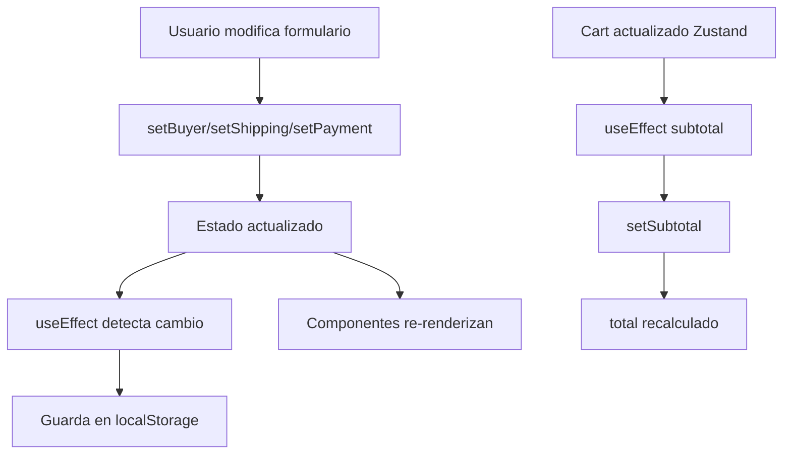

# CheckoutContext.jsx

## Propósito

Contexto de React que gestiona el estado global del flujo de checkout, incluyendo datos del comprador, opciones de envío, método de pago y cálculos de totales. Persiste datos en localStorage.

## Importaciones

```jsx
"use client";

import { createContext, useContext, useState, useEffect } from "react";
import { useCartStore } from "@/store/cartStore";
```

## Creación del Contexto

```jsx
const CheckoutContext = createContext();
```

## Provider Component

### `CheckoutProvider({ children })`

Componente que envuelve las páginas de checkout y provee el estado compartido.

## Estado Gestionado

### 1. Carrito (del Store)

```jsx
const { cart } = useCartStore();
```

Importado desde Zustand, no forma parte del estado local del contexto.

### 2. Buyer (Comprador)

```jsx
const [buyer, setBuyer] = useState({
  name: "",
  email: "",
  phone: "",
  dni: "",
  address: "",
  city: "",
  postalCode: "",
});
```

**Campos**:
-name, email, phone, dni, address, city, postalCode

**Persistencia**: localStorage con key `"checkout_buyer"`

### 3. Shipping (Envío)

```jsx
const [shipping, setShipping] = useState({
  method: "",
  cost: 0,
});
```

**Persistencia**: localStorage con key `"checkout_shipping"`

### 4. Payment (Pago)

```jsx
const [payment, setPayment] = useState("");
```

**Valores**: `"efectivo"`, `"transferencia"`, etc.

**Persistencia**: localStorage con key `"checkout_payment"`

### 5. Subtotal

```jsx
const [subtotal, setSubtotal] = useState(0);
```

Calculado automáticamente desde el carrito.

### 6. Total (Computado)

```jsx
const total = subtotal + shipping.cost;
```

No es estado, se calcula en tiempo real.

## Effects (useEffect)

### 1. Cargar desde localStorage (mount)

```jsx
useEffect(() => {
  const savedBuyer = localStorage.getItem("checkout_buyer");
  const savedShipping = localStorage.getItem("checkout_shipping");
  const savedPayment = localStorage.getItem("checkout_payment");

  if (savedBuyer) setBuyer(JSON.parse(savedBuyer));
  if (savedShipping) setShipping(JSON.parse(savedShipping));
  if (savedPayment) setPayment(savedPayment);
}, []);
```

Se ejecuta una vez al montar el provider.

### 2-4. Guardar en localStorage

```jsx
useEffect(() => {
  localStorage.setItem("checkout_buyer", JSON.stringify(buyer));
}, [buyer]);

useEffect(() => {
  localStorage.setItem("checkout_shipping", JSON.stringify(shipping));
}, [shipping]);

useEffect(() => {
  localStorage.setItem("checkout_payment", payment);
}, [payment]);
```

Cada vez que cambia un valor, se persiste automáticamente.

### 5. Actualizar Subtotal

```jsx
useEffect(() => {
  if (!cart) return;
  const newSubtotal = cart.reduce(
    (acc, item) => acc + item.price * item.quantity,
    0
  );
  setSubtotal(newSubtotal);
}, [cart]);
```

Recalcula cuando el carrito cambia.

## Valor del Contexto

```jsx
<CheckoutContext.Provider
  value={{
    buyer,
    setBuyer,
    shipping,
    setShipping,
    payment,
    setPayment,
    subtotal,
    setSubtotal,
    total,
  }}
>
  {children}
</CheckoutContext.Provider>
```

## Hook Personalizado

### `useCheckout()`

```jsx
export function useCheckout() {
  return useContext(CheckoutContext);
}
```

**Uso en componentes**:
```jsx
import { useCheckout } from "@/context/CheckoutContext";

function MyComponent() {
  const { buyer, setBuyer, total } = useCheckout();
  // ...
}
```

## Persistencia en localStorage

### Keys utilizadas

| Key | Contenido | Formato |
|-----|-----------|---------|
| `checkout_buyer` | Datos del comprador | JSON string |
| `checkout_shipping` | Método y costo de envío | JSON string |
| `checkout_payment` | Método de pago | String simple |

### Comportamiento

1. **Al cargar la página**: Restaura valores guardados
2. **Al modificar valores**: Guarda automáticamente
3. **Al finalizar compra**: Deberían limpiarse

**Limpieza sugerida**:
```jsx
// Después de confirmar compra
localStorage.removeItem("checkout_buyer");
localStorage.removeItem("checkout_shipping");
localStorage.removeItem("checkout_payment");
```

## Flujo de Datos



## Ventajas

1. **Estado centralizado**: Un solo lugar para datos de checkout
2. **Persistencia automática**: No se pierde al refrescar
3. **Cálculos automáticos**: Total siempre actualizado
4. **Scope limitado**: Solo en /checkout (layout anidado)

## Limitaciones

- ⚠️ `BuyerForm` NO usa este contexto (estado local propio)
- ⚠️ No hay validación de datos
- ⚠️ localStorage no es seguro para datos sensibles

## Archivos Relacionados

- [checkout/layout.jsx](file:///c:/Users/Malena%20Cort%C3%A9s/OneDrive/Desktop/tazas-personalizables/frontend/src/app/checkout/layout.jsx) - Envuelve con provider
- [cartStore.ts](file:///c:/Users/Malena%20Cort%C3%A9s/OneDrive/Desktop/tazas-personalizables/frontend/src/store/cartStore.ts) - Store del carrito
- [OrderSummary.jsx](file:///c:/Users/Malena%20Cort%C3%A9s/OneDrive/Desktop/tazas-personalizables/docs/frontend/app/checkout/components/OrderSummary.jsx.md)
- [BuyerForm.jsx](file:///c:/Users/Malena%20Cort%C3%A9s/OneDrive/Desktop/tazas-personalizables/docs/frontend/app/checkout/components/BuyerForm.jsx.md)
